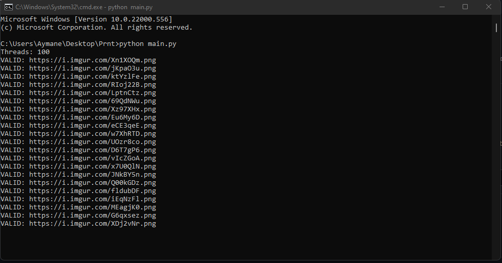

## Prnt Bruteforce

Prnt is a online service made for people to upload their screenshots  and share them with others, The problem with this service is they didn't put any rate limit for their API also the third-party service they're using [imgur.com](imgur.com) they don't have the limit too, so this script use this Vulnerability and try to bruteforce all the possible casses

## Usage

```bash
git clone https://github.com/u-Aymane/prnt.sc-public-imgs
cd prnt.sc-public-imgs
python main.py
```

## Screenshot



## Contributing
Pull requests are welcome. For major changes, please open an issue first to discuss what you would like to change.

## License
[MIT](https://choosealicense.com/licenses/mit/)
